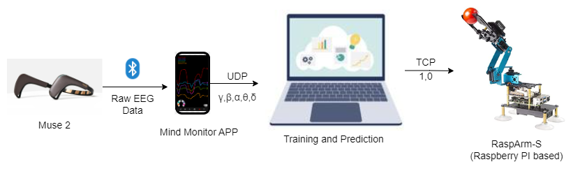

# EEG-Controlled-Robotic Arm

This repository contains the source code for the system presented as a demo at the **IEEE Engineering in Medicine and Biology Society (EMBS)**.

###  Publication
**Title:** Brain-Controlled Robot for Assisting Basic Upper Limb Tasks  
**Link:** [Read the full paper on ResearchGate](https://www.researchgate.net/publication/397546710_Brain-Controlled_Robot_for_Assisting_Basic_Upper_Limb_Tasks)

---

##  System Architecture

### The Pipeline
1.  **Acquisition:** The Muse 2 headband measures brain activity (Alpha, Beta, Gamma, Delta, Sigma waves) via 4 electrodes.
2.  **Streaming:** Data is streamed wirelessly to the Laptop via UDP.
3.  **Inference:** A Python script processes the live EEG feed using a trained classifier to detect mental states (e.g., Focus, Relax, Blink artifacts).
4.  **Actuation:** The predicted class is converted into a motor command and sent to the Raspberry Pi via TCP, which drives the servo motors.

---

## Project Structure

| File Name | Description |
| :--- | :--- |
| `Collect EEG-data.py` | **Data Acquisition:** Listens to the UDP stream from the Muse sensor, labels the data, and saves it for training. |
| `Models/` | **Saved Models:** Directory containing the pre-trained TensorFlow `.h5` models. |
| `Test Classifier Model.py` | **Real-Time Inference:** Loads the trained model, classifies live EEG data, and sends commands to the robot. |
| `Muse-Robot-Control.py` | **Heuristic Control:** A simpler control method using raw artifacts (Jaw Clenches / Blinks) instead of the ML model. |
| `Rasp-Arm-tcpPI.py` | **Server (Robot Side):** Runs on the Raspberry Pi. Listens for TCP commands and drives the motors. |
| `Gui-tcpPC.py` | **Testing Tool:** A PC-side GUI to manually test the TCP connection and robot movements. |

---

##  Hardware Requirements

* **EEG Headset:** Muse 2 (or compatible OSC-streaming headband).
* **Robot:** 4-DOF Robotic Arm (Servos + Driver Board).
* **Controller:** Raspberry Pi (3 or 4 recommended).
* **Computer:** Laptop with Python environment for heavy processing.

---

